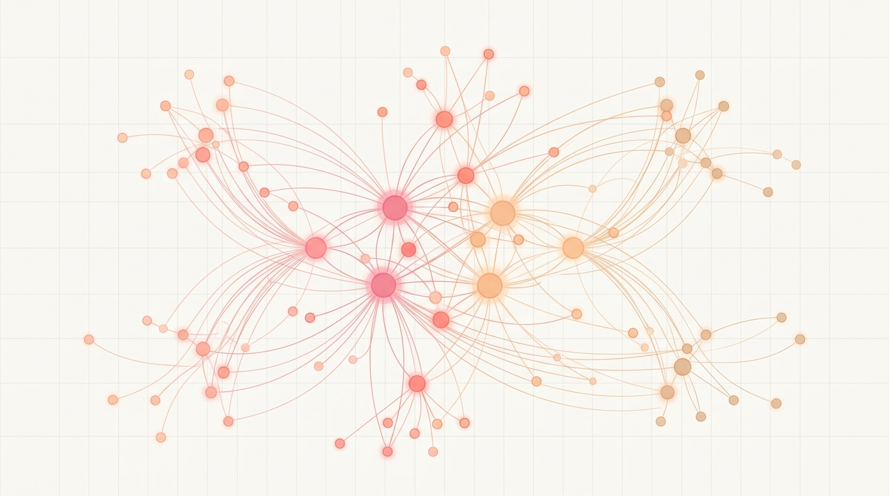

# Mapiranje dinastije Kardashian-Jenner

Interaktivna digitalna mrežna analiza ekosustava Kardashian-Jenner koja istražuje sjecišta reality televizije, globalne trgovine i humanitarnog rada.

## Pregled projekta

Ova aplikacija koristi mrežni graf usmjeren silom (D3.js) unutar React okvira za vizualizaciju složenih odnosa između članova obitelji Kardashian-Jenner, njihovih tvrtki i njihovog društvenog utjecaja.

### Ključni vizualni i funkcionalni stupovi
- **Dinamička fizikalna simulacija**: Simulacija grafa u stvarnom vremenu koja upravlja odbijanjem i privlačenjem između čvorova.
- **Kategorizirana središta (Hubovi)**:
  - **Čvorovi odraslih osoba (Roditelji)**: Ključne obiteljske ličnosti predstavljene većim ljudskim prikazima (Kris, Kim, Khloé, Kourtney, Kendall, Kylie, itd.).
  - **Djeca (Unuci)**: Predstavljeni manjim ljudskim prikazima za dinamički i vizualni prikaz generacijske hijerarhije.
  - **Čvorovi tvrtki**: Višemilijunski i višemilijarderski poslovni pothvati (SKIMS, Kylie Cosmetics, Good American, itd.).
  - **Čvorovi industrija**: Podjela na ljepotu i kozmetiku, modu, pića i medije.
  - **Čvorovi ciljeva/uzroka**: Vizualizacija filantropskog i kulturnog utjecaja, modelirana kao zaobljeni kvadrati radi jasne vizualne podjele.
- **Financijska procjena vrijednosti u stvarnom vremenu (Net Worth)**: Glavni obiteljski predvodnici imaju svoju procijenjenu neto vrijednost (npr. $1,7 milijardi, $710 milijuna) prikazanu u čistim, visokokontrastnim tamnim kvadratima pored svojih ikona na mrežnom grafu.

## Vizualni identitet i redizajnirana legenda

Sučelje je izgrađeno na profinjenoj 'Nude & Clay' (boja kože i gline) estetici, odražavajući prepoznatljivi brending obitelji, naglašeno visokokontrastnim neonskim akcentima i prekrasnom blago rozom pozadinom s elegantnim vodenim žigom dinastije u pozadini. Bočna legenda u potpunosti je kategorizirana po grupama radi veće jasnoće:
1. **✦ Odrasli Članovi**: Roditelji i osnivači s prepoznatljivim bojama obitelji i oznakama Neto vrijednosti (Net Worth).
2. **✦ Djeca (Mlađi Naraštaj)**: Generacijski potomci predstavljeni manjim proporcijama (npr. North, Stormi, Penelope).
3. **✦ Brendovi & Industrija (Krug)**: Kategorizirani poslovni pothvati koji prikazuju tržišne inovacije u modi, ljepoti, kozmetici i pićima.
4. **✦ Humanitarnost & Utjecaj (Kocka)**: Filantropski projekti u rasponu od pravosudne reforme, ekološkog aktivizma do zagovaranja zdravog wellness načina života.

## Detaljni profili članova dinastije (Profili, djeca, brendovi i utjecaj)

Ovdje se nalazi detaljan pregled svakog lika u ekosustavu, s njihovom procijenjenom neto vrijednošću (Net Worth), potomcima, brendovima koje su stvorili te humanitarnim radom:

---

### 1. Kris Jenner ("The Momager")
* **Net Worth (Neto vrijednost):** $170M (Milijuna)
* **Status:** Glava obitelji i glavni arhitekt brenda Kardashian-Jenner.
* **Djeca:** Kourtney Kardashian, Kim Kardashian, Khloe Kardashian, Rob Kardashian, Kendall Jenner, Kylie Jenner.
* **Brendovi & Kompanije:** 
  - *The Kardashians (Hulu)* te izvršna produkcija svih obiteljskih reality formata.
* **Utjecaj na industriju:** Pionirka reality TV formata i genijalna menadžerica koja je preokrenula tradicionalni PR u digitalno poslovno carstvo vrijedno milijarde dolara.
* **Partneri/Brakovi:** Robert Kardashian (bivši muž), Caitlyn Jenner (bivši muž).
* **Humanitarni rad:** Aktivno podržava rad dječjih bolnica, donira zakladama za borbu protiv raka te redovito osigurava resurse i hranu za pučke kuhinje u Los Angelesu.

---

### 2. Robert Kardashian (Otac)
* **Status:** Poznati američki odvjetnik i poduzetnik.
* **Djeca:** Kourtney, Kim, Khloe, Rob.
* **Utjecaj na industriju:** Njegova obrana u "suđenju stoljeća" (O.J. Simpson) utemeljila je modernu eru medijske fascinacije pravosuđem i slavnim osobama.
* **Partneri/Brakovi:** Kris Jenner (bivša supruga).
* **Aktivizam i sjećanje:** U njegovo sjećanje osnovana je Specijalna onkološka klinika *Robert G. Kardashian* na UCLA.

---

### 3. Caitlyn Jenner
* **Status:** Olimpijska legenda i globalna zagovornica prava transrodnih osoba.
* **Djeca:** Kendall Jenner, Kylie Jenner (uz djecu iz prethodnih brakova).
* **Utjecaj na industriju:** Osvajačica zlatne olimpijske medalje u desetoboju, čiji je sportski i medijski uspjeh poslužio kao temelj za desetljeća televizijske prisutnosti te motivacijsko govorništvo.
* **Partneri/Brakovi:** Kris Jenner (bivša supruga).
* **Humanitarni rad:** Jedna od najistaknutijih figura u borbi za prava i vidljivost transrodnih osoba na globalnoj razini, dobitnica prestižne nagrade *Arthur Ashe Courage Award*.

---

### 4. Kim Kardashian
* **Net Worth (Neto vrijednost):** $1.7B (Milijarde) – status milijarderke.
* **Djeca:** North West, Saint West, Chicago West, Psalm West.
* **Brendovi & Kompanije:**
  - *SKIMS* (brend za oblikovanje tijela i odjeću, procijenjen na preko 4 milijarde dolara).
  - *SKKN by Kim* / *KKW Beauty* (luksuzna kozmetika i njega kože).
  - *KKW Fragrance* (mirisi i linije parfema).
  - *Kimoji* (mobilne aplikacije i digitalni brend).
  - *Kim Kardashian: Hollywood* (legendarna mobilna igrica).
* **Utjecaj na industriju:** Redefinirala je modernu modnu industriju i pojam oblikovanja tijela uvođenjem inkluzivnih veličina. Postavila je globalne smjernice za trendove konturiranja, estetike i utjecaja na društvenim mrežama.
* **Partneri/Brakovi:** Kanye West (bivši muž), Kris Humphries (bivši muž).
* **Humanitarni rad & Aktivizam:** Istaknuta aktivistica za reformu pravosuđa. Surađuje sa zakladom *Innocence Project* i *Cut50*, osobno financira rad odvjetničkih timova za oslobođenje nepravedno osuđenih osoba te je uspješno lobirala za zakonske reforme u Bijeloj kući. Pomaže i bolnicama te donira tijekom prirodnih katastrofa.

---

### 5. Kylie Jenner
* **Net Worth (Neto vrijednost):** $710M (Milijuna)
* **Djeca:** Stormi Webster, Aire Webster.
* **Brendovi & Kompanije:**
  - *Kylie Cosmetics* (koju je izgradila i prodala većinski udio Coty-u).
  - *Kylie Skin* (proizvodi za njegu kože).
  - *Kylie Baby* (sigurni i čisti proizvodi za bebe).
  - *Kendall + Kylie* (zajednička modna linija sa sestrom Kendall).
* **Utjecaj na industriju:** Prepoznana od strane Forbesa kao najmlađa "self-made" milijarderka u povijesti zahvaljujući kozmetičkom carstvu. Samostalno je redefinirala koncept izravne prodaje (DTC) putem platformi društvenih medija te postavila standarde modernog influencer-marketinga.
* **Partneri:** Travis Scott (bivši partner).
* **Humanitarni rad:** Glavna ambasadorica međunarodne organizacije *Smile Train* kojoj donira značajan dio profita za osiguravanje besplatnih operacija rascjepa usne i nepca za djecu diljem svijeta, te velika donatorica *Teen Cancer America*.

---

### 6. Kendall Jenner
* **Net Worth (Neto vrijednost):** $60M (Milijuna)
* **Djeca:** Nema djece.
* **Brendovi & Kompanije:**
  - *818 Tequila* (nagrađivana premium tekila proizvedena u Jalisco, Meksiko).
  - *Kendall + Kylie* (zajednička modna marka).
* **Utjecaj na industriju:** Jedan od najplaćenijih svjetskih supermodela visoke mode. Njezin brend *818 Tequila* prepoznat je po iznimnoj pažnji posvećenoj ekološkoj održivosti, društvenoj odgovornosti i etičkoj proizvodnji.
* **Humanitarni rad:** Aktivna ambasadorica i donatorica neprofitne organizacije *charity: water* za opskrbu čistom vodom u zemljama u razvoju te redovita sponzorica dječjih onkoloških odjela (između ostalog i UCLA Children's Hospital).

---

### 7. Khloé Kardashian
* **Net Worth (Neto vrijednost):** $60M (Milijuna)
* **Djeca:** True Thompson, Tatum Thompson.
* **Brendovi & Kompanije:**
  - *Good American* (revolucionarna modna marka fokusirana na inkluziju svih veličina).
  - *Safely* (ekološka i sigurna sredstva za čišćenje doma).
  - *The Khloe Kardashian Podcast* / *Khloud*.
* **Utjecaj na industriju:** Suosnivačica brenda *Good American* koji je iz temelja potresao modnu maloprodaju zahtijevajući da sve veličine budu izložene i prodavane zajedno, čime je postala globalna ikona "body positivity" pokreta.
* **Partneri:** Tristan Thompson (bivši partner).
* **Humanitarni rad:** Redovito donira dječjim bolnicama diljem SAD-a, pokreće i sufinancira kampanje protiv cyberbullyinga (zlostavljanja na internetu) te se snažno i aktivno bori za žensko osnaživanje.

---

### 8. Kourtney Kardashian
* **Net Worth (Neto vrijednost):** $65M (Milijuna)
* **Djeca:** Mason Disick, Penelope Disick, Reign Disick, Rocky Barker.
* **Brendovi & Kompanije:**
  - *Poosh* (globalna lifestyle i wellness platforma).
  - *Lemme* (visokokvalitetni prirodni dodaci prehrani i vitamini u obliku bombona).
* **Utjecaj na industriju:** Predvodnica u promicanju čistog i zdravog načina života (clean & organic lifestyle). Kroz svoje brendove uspješno je spojila wellness s modernom estetikom i podigla svijest o važnosti ekoloških sastojaka u kozmetici.
* **Partneri:** Scott Disick (bivši partner), Travis Barker (suprug).
* **Humanitarni rad & Aktivizam:** Pionirka u lobiranju pred američkim Kongresom za donošenje novih, strožih zakonskih propisa o regulaciji i ispitivanju sastojaka unutar kozmetičkih proizvoda, štiteći zdravlje i sigurnost svih potrošača.

---

### 9. Rob Kardashian
* **Net Worth (Neto vrijednost):** $10M (Milijuna)
* **Djeca:** Dream Kardashian.
* **Brendovi & Kompanije:**
  - *Arthur George* (linija luksuznih i kreativnih dizajnerskih čarapa).
* **Utjecaj na industriju:** Pokazao je da se duh obiteljske kreativnosti može primijeniti i na visoko-nišne modne proizvode poput čarapa s humorističnim i trendi natpisima.
* **Partneri:** Blac Chyna (bivša partnerica).
* **Humanitarni rad:** Podržava mnogobrojne partnerske obiteljske inicijative i organizira donacije za dječje medicinske zaklade i preventivne programe.

---

## Tehnička arhitektura

- **Klijentski dio (Frontend)**: React 18+ koji pokreće iznimno brzi Vite.
- **Vizualizacija**: D3.js za osnovni mehanizam odnosa i SVG iscrtavanje.
- **Stiliziranje**: Tailwind CSS za moderan, responzivan izgled s efektima stakla (glassmorphism).
- **Model podataka**: Relacijska TypeScript struktura definirana u datoteci `src/data.ts`.

## Znanstveni i kulturološki kontekst

Ovaj projekt služi kao digitalna humanistička studija o 'mrežnoj centralnosti' (Network Centrality) unutar kulture slavnih osoba. Mapira kako se istaknutost u reality televiziji prevodi u strukturni utjecaj na globalne industrije i društvene reforme.

Detaljna analiza može se pronaći u datoteci `/report/report_1.md`.

---
*Kreirano kao digitalni prikaz medija, trgovine i filantropije.*
